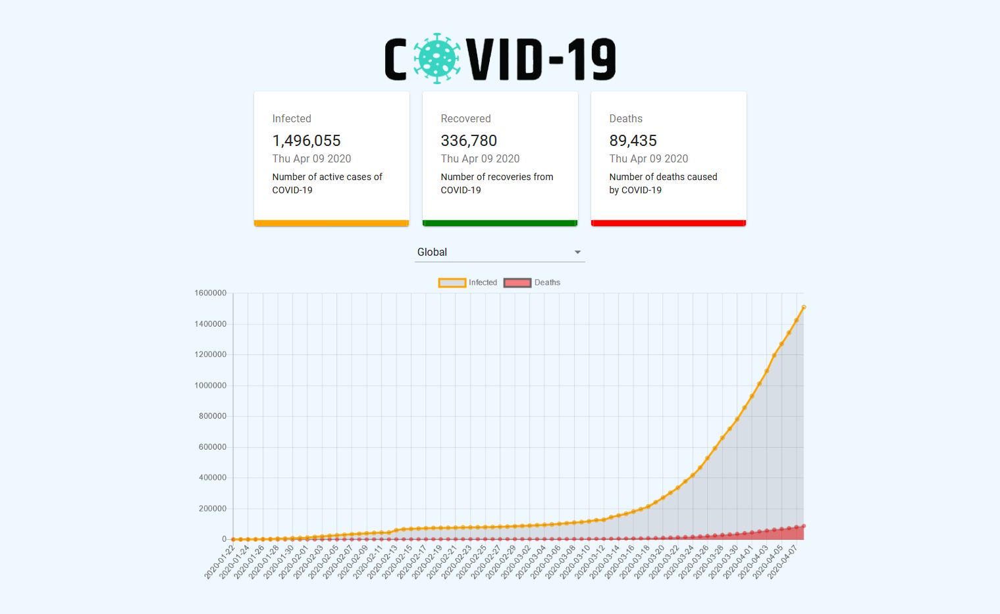

# **A Corona Tracking Application**

**Live Project:** https://kirankumargonti.github.io/covid19-tracker/

**API used: https://covid19.mathdro.id/api**

## **Quick Start**

    # Install dependencies
    $ npm install

    # Serve on localhost:3000
    $ npm start

    # Build for production
    $ npm run build

### **Snapshot**

